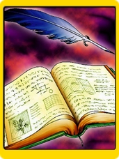
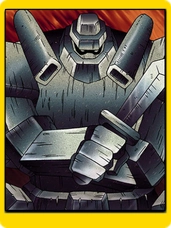
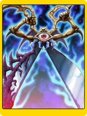
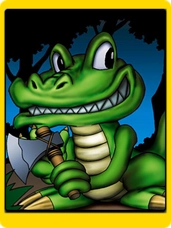
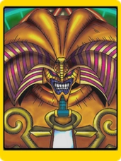

# Yu-Gi-Oh | Jokenpô

**Tendo como base o jogo feito nas aulas, criei minha variação do jogo Jokenpô com uma temática do anime Yu-Gi-Oh. Utilizei as regras do Pedra - Papel - Tesoura - Lagarto - Spock, para assim usar mais cartas e reduzir as chances da rodada terminar em empate.**

- **Como citado antes, adicionei mais dois tipos(Lagarto e Spock), para reduzir as chances de uma rodada terminar em empate.** 
- **Editei as imagens para que todas elas ficassem com o mesmo estilo de carta.**
- **Adicionei informações sobre de quem a carta ganha e de quem ela perde, assim ajudando o jogador na hora da escolha.**
- **Implementei uma função para que ao tirar o mouse em cima da carta, as informações da mesma também sumam.**
- **Fiz com que sempre sorteasse 5 cartas diferentes para a mesa dos jogadores, assim ele podendo escolher entre uma das 5 opções.**
- **Adicionei uma janela com mensagem personalizada, caso a pessoa tenha vencido, empatado ou perdido a rodada.**
- **Coloquei o botão para o próximo duelo.**
- **Deixei o jogo responsivo.**

### Tecnologias Utilizadas

- HTML5 e CSS3 para a estrutura e aparência do jogo.
- JavaScript para a lógica de programação e interatividade.
- Efeitos sonoros e imagens customizadas, para uma melhor experiência ao jogar.
- SweetAlert2 para colocar uma mensagem mais customizada.

### Funcionalidades

- **Passe o mouse sobre uma carta para ver informações**: Passe o mouse sobre uma carta para ver as informações do tipo de carta e de que tipo ela é forte ou fraca.
- **Placar do Jogo**: No lado esquerdo há o placar do jogo com a sua quantidade de vitórias e derrotas.

### Informações sobre as Cartas
Carta | Nome | Tipo | Ganha de: | Perde para:
:---: | :--: | :--: | :-------: | :---------:
| Livro das Artes Secretas | Papel | Pedra e Spock | Tesoura e Lagarto
 | Soldado de Pedra Gigante | Pedra | Tesoura e Lagarto | Papel e Spock
 | Tesoura das Almas | Tesoura | Papel e Lagarto | Pedra e Spock
 | Jacaré Toon | Lagarto | Papel e Spock | Pedra e Tesoura
 | Exodia, "O Proibido" | Spock | Pedra e Tesoura | Papel e Lagarto

**Link do jogo: [https://jonas-holanda.github.io/jokenpo-game/](https://jonas-holanda.github.io/jokenpo-game/)**

    <strong>Copyright © <a href="https://github.com/jonas-holanda" target="_blank">Jonas Holanda</a>. All Rights Reserved.</strong>

